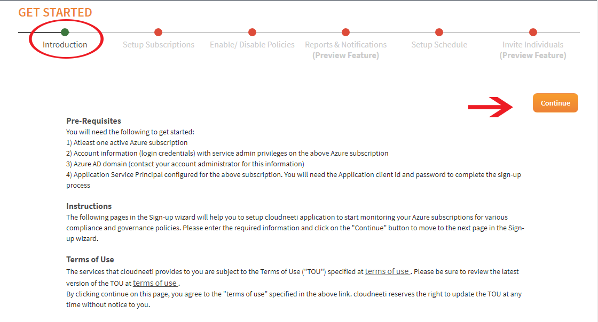

# CloudNeeti Onboarding and Troubleshooting

**Introduction** : **Cloudneeti** is a governance cohort, bringing together an integrated approach across various disciplines of governance. With some simple configurations, Cloudneeti can help you pull information from applications / systems deployed on Azure and inform you through various notifications, dashboards and reports about –
a. Compliance against industry standards such as PCI DSS, HIPAA, CIS Security Benchmark 
b. Optimizing your Spend on the cloud subscription (are you over-subscribed or under-subscribed)
c. Reliability of your cloud environments (efficacy of backups, downtime alerts)
d. Reducing Risk by detecting and alerting non-compliant configurations 

## Onboarding Azure Subscription to CloudNeeti

To onboard an Azure subscription to your CloudNeeti Account

**Click on Get Started**  **-->** Wizard Screen will appear:
](images/Get%20Started.PNG)

**Step 1:** The first step of the Wizard contains introductory information, read Pre-Requisites, Instructions, Terms of Use, Privacy Policy and **Click on Continue** button

**STEP 2:** Next step of the Wizard will ask you to enter Subscription details for which you would want CloudNeeti to monitor and get alerted on your security and compliance posture of the entire environment, all fields are mandatory.

](images/Introduction.PNG)

a.	Enter the Domain Name and Tenant ID. 
    * To find the Domain name and Tenant ID, Login to the Azure Portal, choose your Azure AD tenant by selecting your account in the top right corner of the page 
    * Then click on Azure Active Directory from left pan of the portal and click on properties to get the Domain and Tenant ID
    
        ](images/Domain%20and%20Tenant%20ID.PNG)

    
b.	Enter the Subscription id 
c.	Select the Current offer from drop down list of our active offers
d.	Enter Azure Active Directory application id and password which you have configured during installation of CloudNeeti
e.	Enter the email id for notification
f.	**Click Save and Continue** button.

**After Step 2**, you will be redirected via a sign-in request to the authentication endpoint in Azure AD.  Once you signed in, Azure AD returns a sign-in response through the application, which contains claims about the user and Azure AD that are required by the application to validate the token.

If authentication is successful, you will be taken to the third step of the wizard.

**STEP 3:** Next step of the Wizard will allow you to Enable or Disable Policies/Rules around governance monitoring

Select down arrow/+ sign to expand the list of policies/rules you would want to enable or disable, select respective check box and **Click Save and Continue** button.

**STEP 4:** Next step is to setup the schedule for scan interval/frequency. Select frequency and next run time then **Click Save and Continue** button.

**STEP 5:** Last step from the wizard is to invite users by selecting check box from the list of users with the VM link to the CloudNeeti application informing that, CloudNeeti application has been installed and they can now access it.

**Click on Finish button.**

After completion of above steps successfully, you will be redirected to the status page. 

Once all services are completed you will be automatically redirected to the Subscription Dashboard. 

# Troubleshooting

Coming soon !!

