
# Configuration and User Guide 

**Introduction** : **Cloudneeti** is a governance cohort, bringing together an integrated approach across various disciplines of governance. With some simple configurations, Cloudneeti can help you pull information from applications / systems deployed on Azure and inform you through various notifications, dashboards and reports about –

1. Compliance against industry standards such as PCI DSS 3.2, HIPAA, Cyber Security Foundations, Security Benchmark, NIST CSF, GDPR. 
2. Optimizing your Spend on the cloud subscription (are you over-subscribed or under-subscribed)
3. Reliability of your cloud environments (efficacy of backups, downtime alerts)
4. Reducing Risk by detecting and alerting non-compliant configurations
 
## Types of User Roles
* License Administrator - can do the following activities
* Subscription Administrator
* Subscription Reader

|   | License Administrator  | Subscription Administrator  | Subscription Reader  |
|---|:---:|:---:|:---:|
| View Dashboard  | :white_check_mark:  |  :white_check_mark:  | :white_check_mark:  |
| Add License Administrator  | :white_check_mark:  |  :x:  | :x:  |
| Add Tenant | :white_check_mark:  |  :x:  | :x:  |
| Edit Tenant  |  :white_check_mark:  |  :x:  | :x:  |
| Delete Tenant  |  :white_check_mark:  |  :x:  | :x:  |
| Add Subscription  | :white_check_mark:  |  :x:  | :x:  |
| Edit Subscription  | :white_check_mark:  |  :x:  | :x:  |
| Delete Subscription  | :white_check_mark:  |  :x:  | :x:  |
| Configure Subscription  | :white_check_mark:  |  :white_check_mark:   | :x:  |

## Onboarding Azure Subscriptions to Cloudneeti

To onboard an Azure subscription to your Cloudneeti product

**Click on Get Started**  **-->** Wizard Screen will appear:

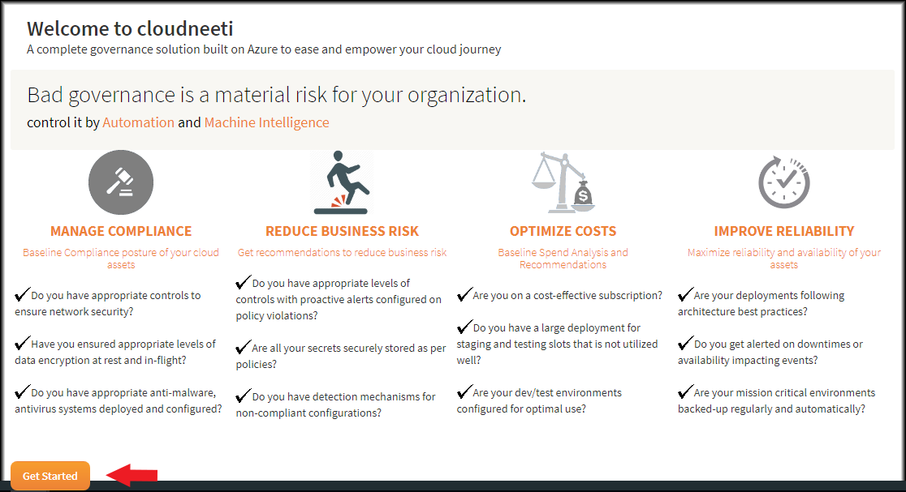

### Step 1:
After clicking on Get started, portal displays "Register your Azure Active Directory Tenant" page for entering the information related to Azure Tenant.

* Enter the Domain Name and Tenant ID. 

    * To find the Domain name and Tenant ID, Login to the Azure Portal, choose your Azure AD tenant by selecting your account in the top right corner of the page 
    * Then click on Azure Active Directory from left pan of the portal and click on properties to get Tenant ID

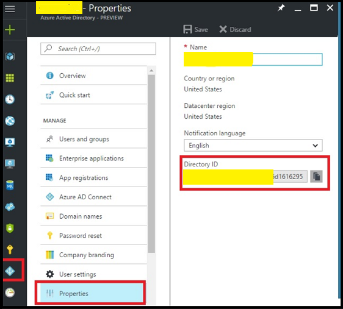](images/DomainAndTenantID.png)
* To get the Domain Name select Custom Domain Names and primary tick mark name is the Domain Name

](images/DomainName.png)

* Enter Azure Active Directory application id and password which you have configured during configuration of Cloudneeti
* **Click Create** button for adding the Tenant details.

### Step 2:
Once the Tenant details are saved, portal displays "Sign-in to connect your Azure Subscription" and provides two option for connecting as follows
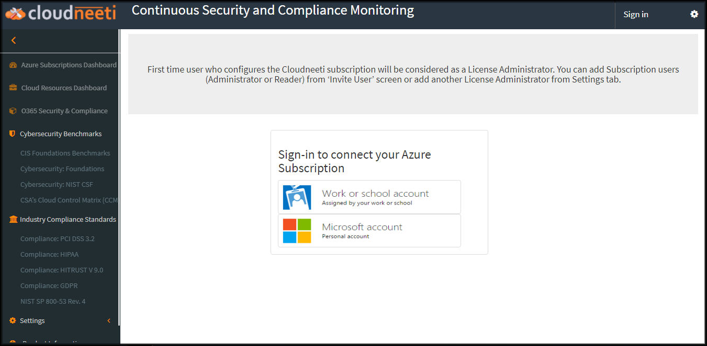
* Work or School Account - Use your Work Account Credentials for Authentication.
   
* Microsoft Account - Enter your Domain Name which was entered by you while entering the Tenant and click on **Go** Button. Then enter your Microsoft Live Id credentials for Authentication.

### Step 3:
The first step of the Wizard contains introductory information, read Pre-Requisites, Instructions, Terms of Use, Privacy Policy and **Click on Continue** button

### STEP 4:
Next step of the Wizard will ask you to enter Subscription details for which you would want Cloudneeti to monitor and get alerted on your security and compliance posture of the entire environment, all fields are mandatory.

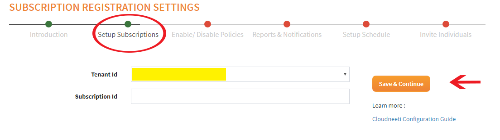
* Select at-least one Tenant Id 
* Enter correct Subscription id for proceeding to the next step
* **Click Save and Continue** button.

### STEP 5:
Next step of the Wizard will allow you to Enable or Disable Policies/Rules around governance monitoring

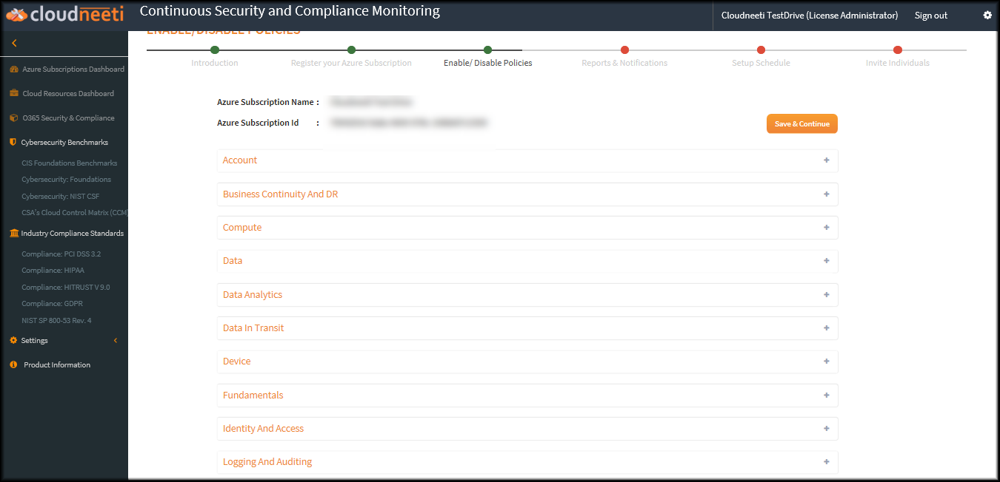

Select down arrow/+ sign to expand the list of policies/rules you would want to enable or disable, select respective check box and **Click Save and Continue** button.

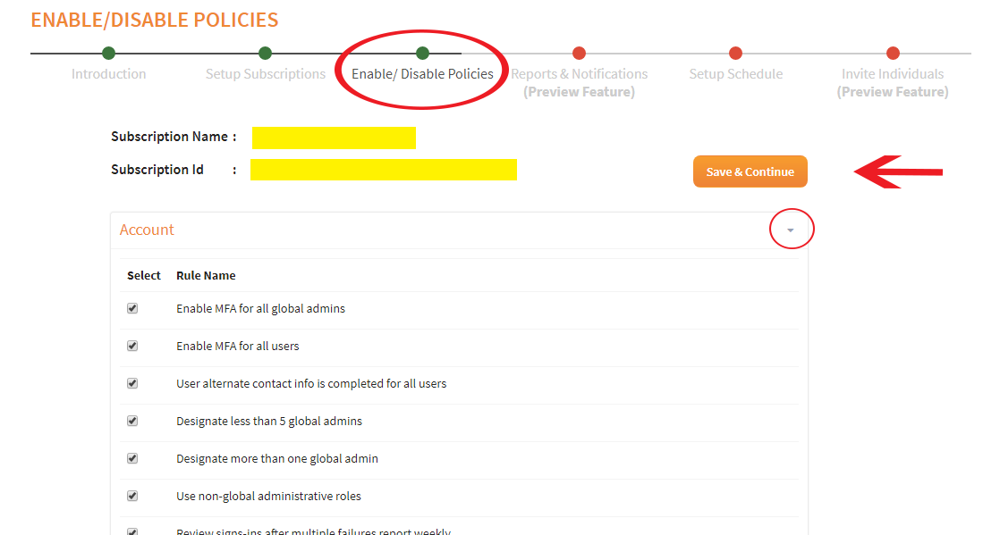

### STEP 6:
Next step of the Wizard will allow you to configure the Reports and Notifications. 

You can use existing Azure Storage account or can create new one. For creating new Storage account, select More Services in Azure portal and search for Storage accounts and open the blade.

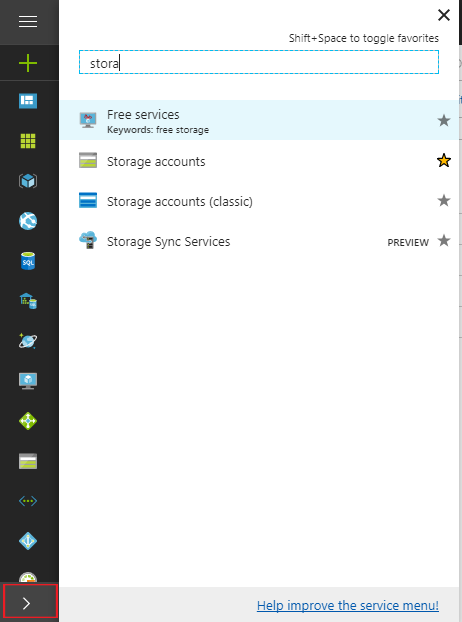

Click on Add, for adding new Storage account.

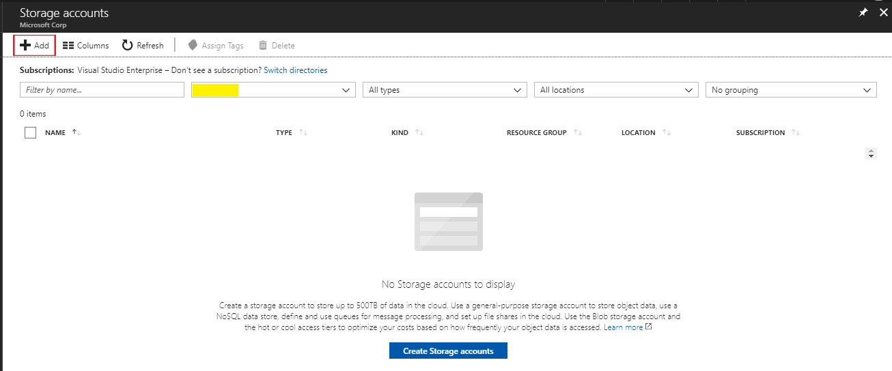

Enter valid storage account Name and select the subscription. Select existing resource group or create new resource group. You can modify other options as per the requirement and finally click on the create Button. 

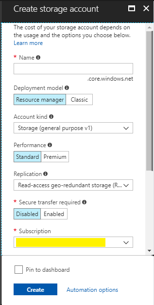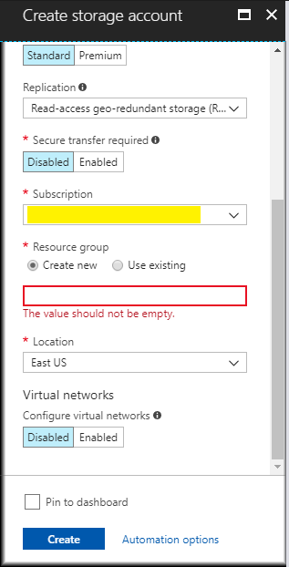

Which will create new storage account. Open your storage account blade and then you can copy storage account name and key1 by clicking on Access Keys.

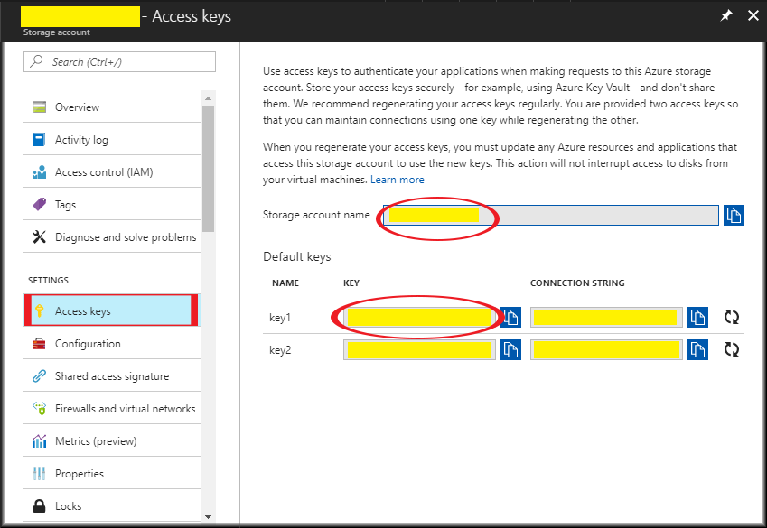

In this step, enter Azure Storage account name and key which will used for storing the Benchmark Reports (Word Document). You can download the latest report from the portal by accessing Benchmark Dashboards. For accessing all the previous reports, you can access it from the storage account.

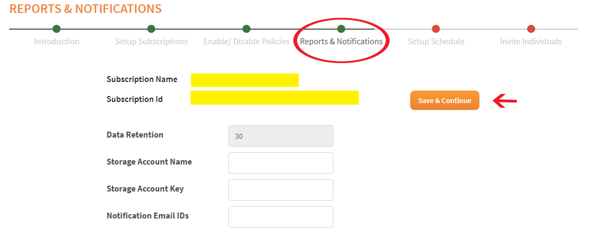
* Data Retention - provide the number of days, the reports need to be preserved. Editing data retention is enabled only for License type of Enterprise or MSP. For others it taken automatically as per the License type.
* Storage Account Name - enter the storage account name where reports need to be stored.
* Storage Account Key - enter storage account key
* Notification Email IDs - enter comma separated email Ids who should receive the notification emails.
* **Click Save and Continue** button.

### STEP 7:
Next step is to setup the schedule for scan interval/frequency. Select frequency and next run time then **Click Save and Continue** button.

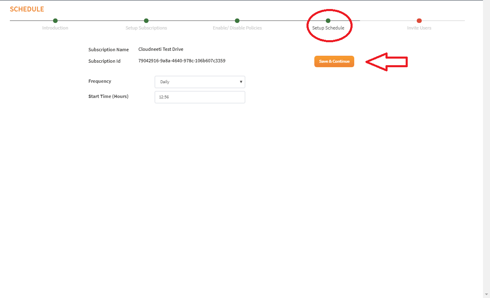

### STEP 8:
Last step from the wizard is to invite users by selecting check box from the list of users with the VM link to the Cloudneeti application informing that, Cloudneeti application has been installed and they can now access it.

**Click on Finish button.**

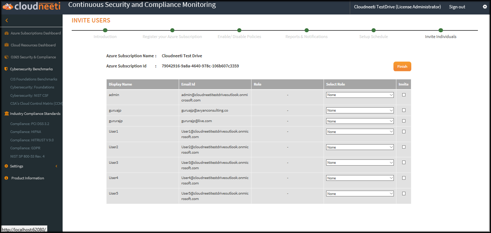

After completion of above steps successfully, you will be redirected to the status page. 

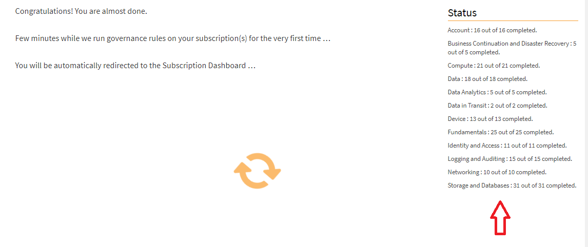

Once all services are completed you will be automatically redirected to the Subscription Dashboard. 

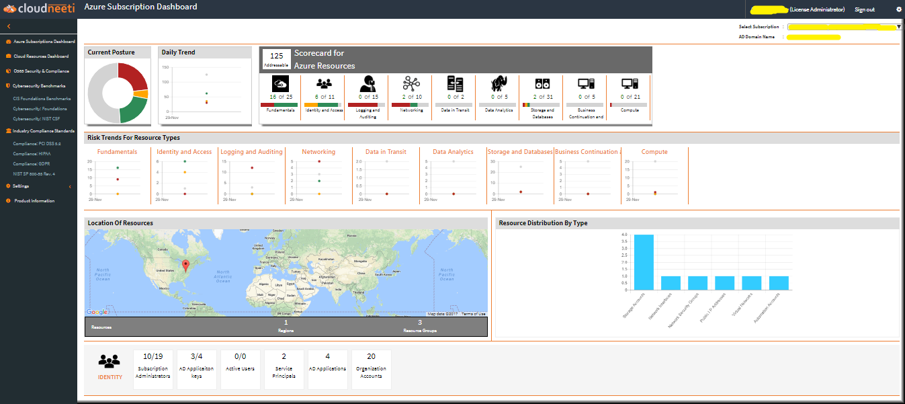

### Steps for adding License Administrator:
 As you are the first person for entering the Tenant details, you will be assigned the role of "License Administrator". You can add another License Administrator and to do so follow the menu Settings => Add License Administrator => Add New
 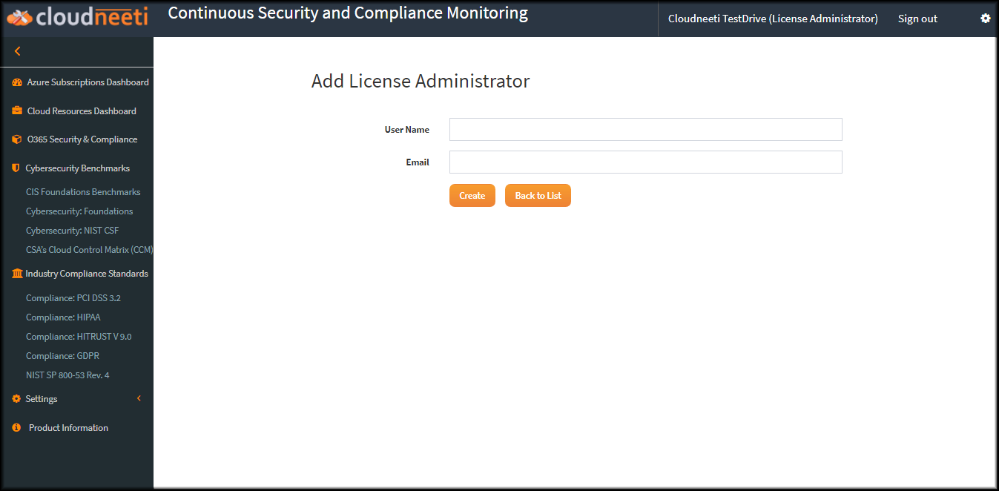
 This step could be followed at any time as per requirement and can be skipped for now.

