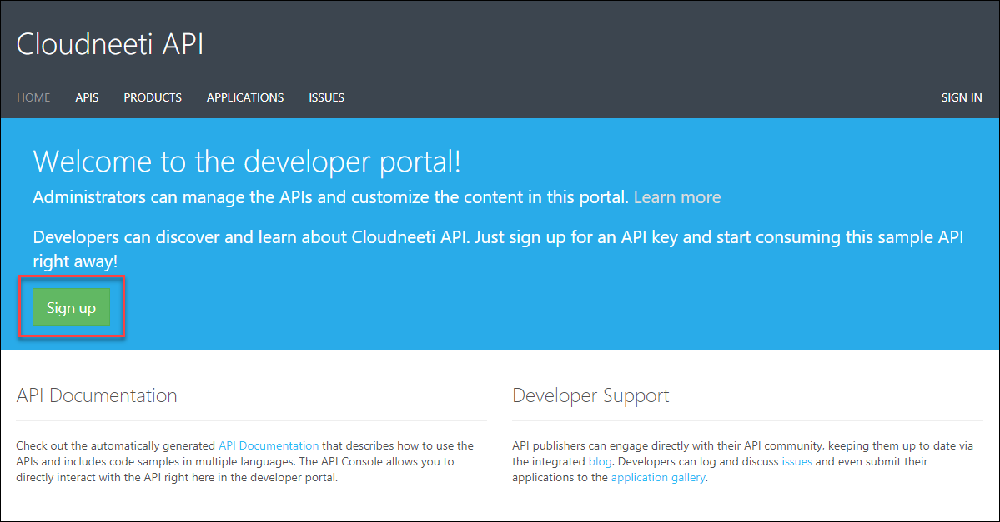
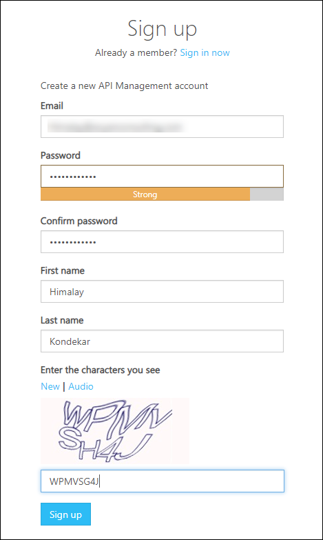
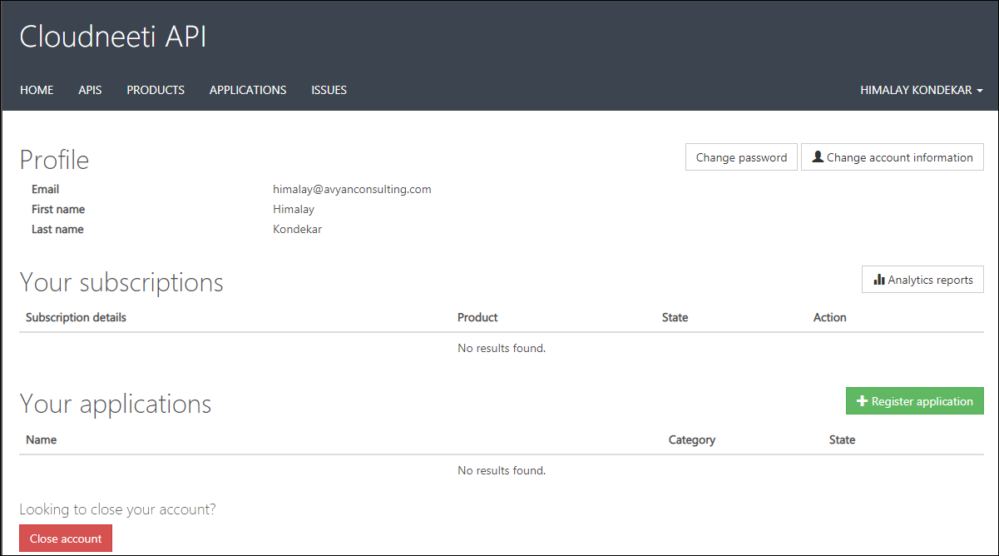
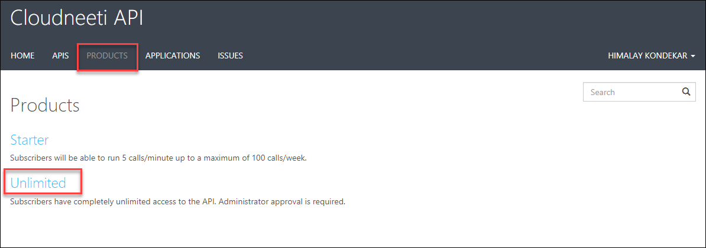
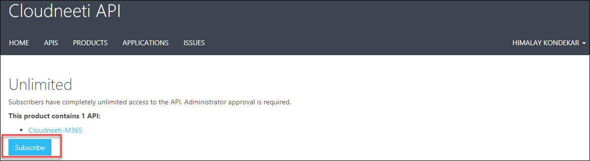
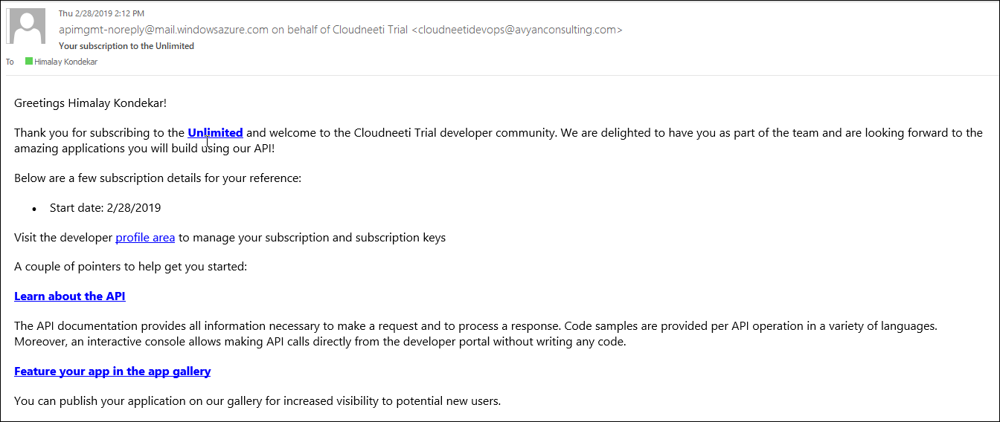
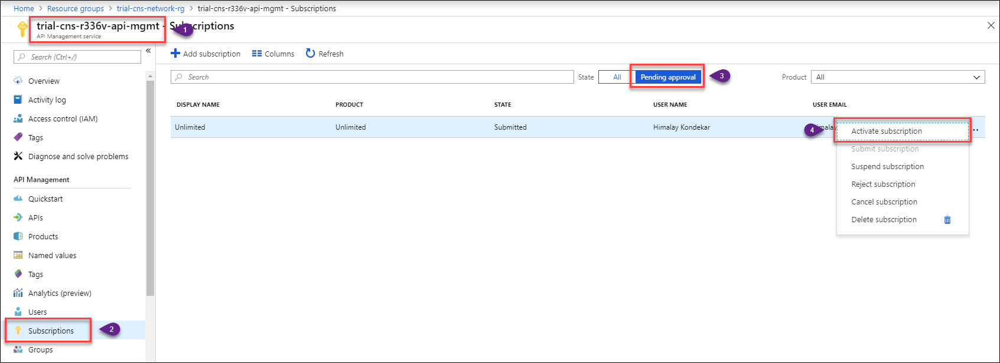

## **Cloudneeti API key Generation Procedure** 

**Step 1.** Go to API portal and Sign up: `<Environment>portal.cloudneeti.com`
        Example: trialportal.cloudneeti.com

Fill the required fields in the sign-up form

You will receive a confirmation mail for sign-up, Click on the confirmation link.

The confirmation link will ask you for change password (info: You can use a password which used while signup)

You are signed up successfully.

**Step 2.** Now click on the **PRODUCTS** tab > **Unlimited** Option

Click on **Subscribe** & **Confirm**. (Note: This will notify to Cloudneeti team and Cloudneeti team will Active your subscription. Please wait for approval)

Once Cloudneeti team activate your subscription, you will get notification thru and email.

**Step 3.** Once you get the confirmation. Click on Username and select **PROFILE**
Now, To get the Cloudneeti API key click on **Show**. It will show hidden value and just copy the API key

## **For Cloudneeti Team (To approve customer subscription request) [Not for Customer]**
- Cloudneeti admin will receive an email for new subscription
- Go to API management resource group
- Click on **Subscriptions** option. Select **Pending Approval** >> Select Customer request >> options >> **Active Subsctiption**

