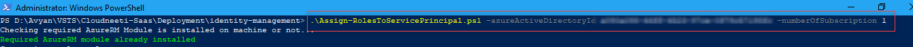
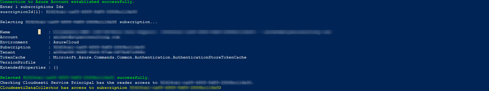
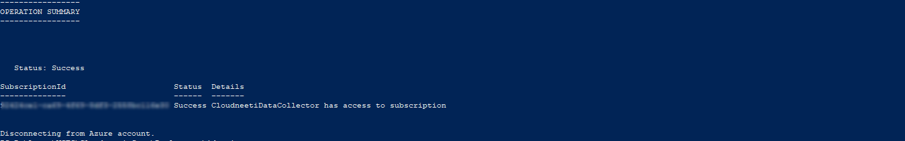

# Assign Role Assignments to Service Principal

## **Prerequisite:**
  
- Open PowerShell as administrator (right click on PowerShell and select run as administrator)
- Download the Assign-RolesToServicePrincipal script from [`here`](https://github.com/AvyanConsultingCorp/docs_cloudneeti/blob/master/scripts/Assign-RolesToServicePrincipal.ps1)
- **PowerShell version should be 5 or above**
To check PowerShell version type `$PSVersionTable.PSVersion` in PowerShell and you will find PowerShell version, below example version is 5.1.17134.228.

If PowerShell version is lower than 5 then follow link https://docs.microsoft.com/en-us/powershell/scripting/setup/installing-windows-powershell?view=powershell-6

- **AzureAD module installed**
To check Azure AD version type `Get-InstalledModule -Name AzureAD` in PowerShell window
 
If version is lower or not installed, type command `Install-Module -Name AzureAD -MinimumVersion 2.0.0.131` in PowerShell window.

- **AzureAD Application should be exist**
The service principal which is created by `Create-ServicePrincipal.ps1` script.

## **Steps:**  
1. Run the `Assign-RolesToServicePrincipal.ps1` with parameters as shown bellow.  

2. A login prompt will be popped out. Login with valid credentials.   
3. A prompt will appear on screen; input a valid subscription ids to which you want to allow Cloudneeti-Data-Collector access. 

Script will continue to execute when you hit enter.  

4. The role assignment will be completed. Yowill see the following screen.  
