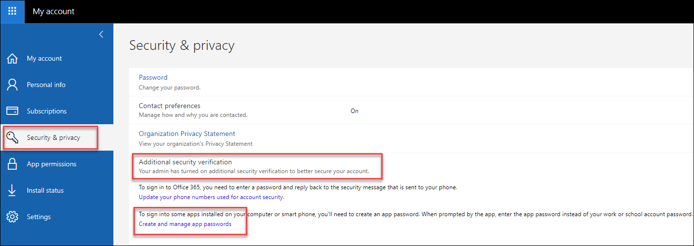
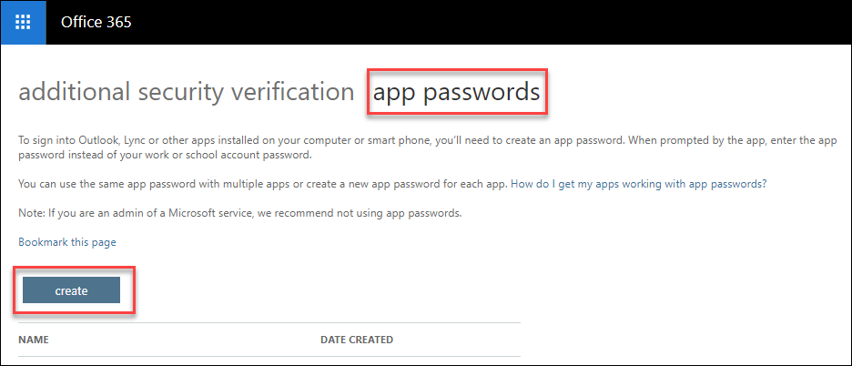
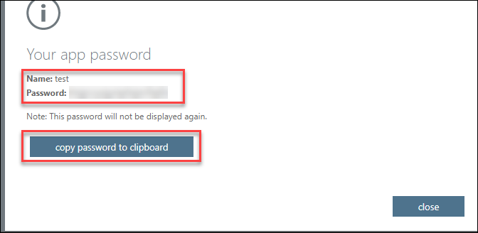

**Prerequisites**:
- Check whether your Office 365 admin has turned on multi-factor authentication for your account.

### **To create another app password:**
1. Sign in to Office 365.

2. Choose **My Account** Settings button > Office 365 portal  

3. Choose **Security & Privacy** > **Additional security verification,** And Click on **Create and manage app passwords** option 

    

4. At the top of the page, choose **App Passwords.** and choose **create** to get an app password. 
   

 5. Choose **copy password to clipboard**. You won't need to memorize this password. 
