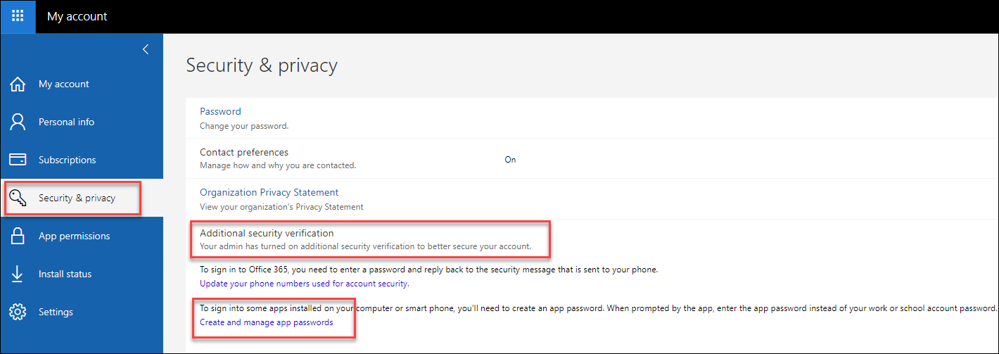
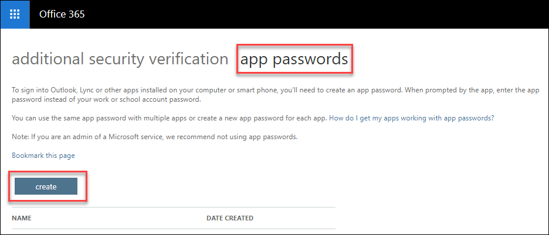
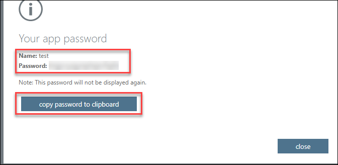
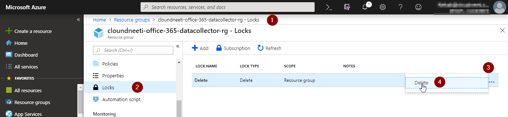
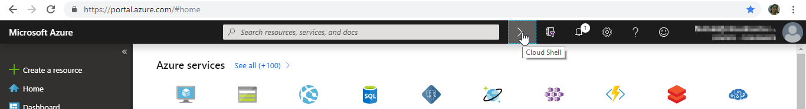
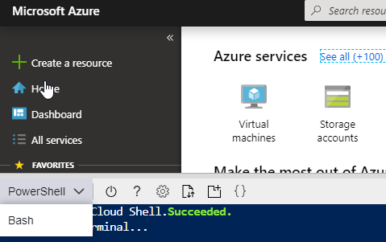
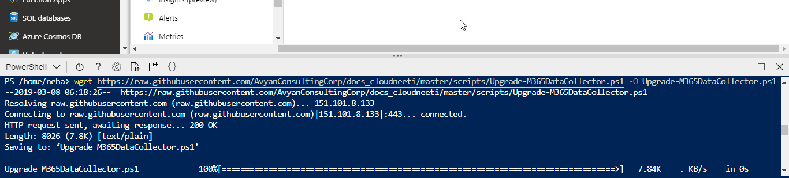
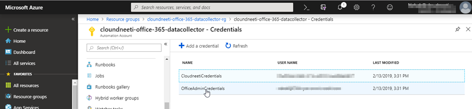

**M365 Data Collector Upgrade**

**Document contains below steps,**

1.  Generating APP password for office MFA enabled user

2.  Delete resource group lock

3.  Upgrade office 365 data collector to v 1.1

4.  Change app password in credential object

    **Pre-requisites:**

    **Step1: Generate APP Password**

    Check MFA of Office 365 Admin user is enabled and create app password.

5.  Sign in to Office 365.

6.  Choose My Account Settings button \> Office 365 portal

7.  Choose Security & Privacy \> Additional security verification, And Click
    on Create and manage app passwords option

>   D:\\SP Demo\\MFA Account.png

1.  At the top of the page, choose App Passwords. and choose to create to get an
    app password.

>   D:\\SP Demo\\MFA Account PWD.png

1.  Choose copy password to clipboard save it for future use.

>   D:\\SP Demo\\MFA Account PWD Store.png

**Step 2: Delete Resource group lock (if applied)**

Delete lock from M365 Data Collector resource group

1.  On Azure portal go to Home -\> Resource groups -\>
    *\<cloundneeti-office-365-datacollector-rg\>*

2.  Go to locks and delete the lock

**Step 3: Upgrade M365 Data collector**

Execute updated script to upgrade the M365 Data Collector

1.  On Azure portal, open cloudshell

1.  Select Powershell

1.  In cloud shell execute below command to download upgrade script

| wget [`https://raw.githubusercontent.com/AvyanConsultingCorp/docs_cloudneeti/master/scripts/Upgrade-M365DataCollector.ps1 -O Upgrade-M365DataCollector.ps1`](https://raw.githubusercontent.com/AvyanConsultingCorp/docs_cloudneeti/master/scripts/Upgrade-M365DataCollector.ps1%20-O%20Upgrade-M365DataCollector.ps1) |
|---------------------------------------------------------------------------------------------------------------------------------------------------------------------------------------------------------------------------------------------------------------------------------------------------------------------|

1.  Switch to user directory and execute below command to upgrade m365 data
    collector

| cd \$user ./Upgrade-M365DataCollector.ps1 -ArtifactsName \` -DataCollectorVersion 1.1 \` -AzureSubscriptionId \<subscriptionId_of_m365datacollector\>\` -DataCollectorName \<Office 365 Data Collector Name\> \` -Location \<Region\> |
|---------------------------------------------------------------------------------------------------------------------------------------------------------------------------------------------------------------------------------------|

Script will prompt Cloudneeti artifacts access key.

**Step 4: Modify credential object in Automation account**

Change password to Application Password

1.  On Azure portal go to Automation account

2.  Click on “OfficeAdminCredentials”

3.  Update password with App Password created in step 1

Run the automation account to verify.
