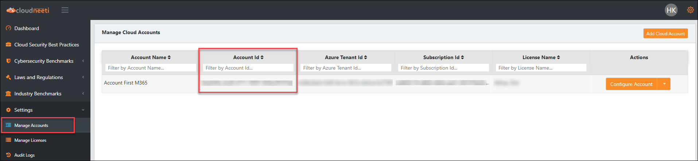
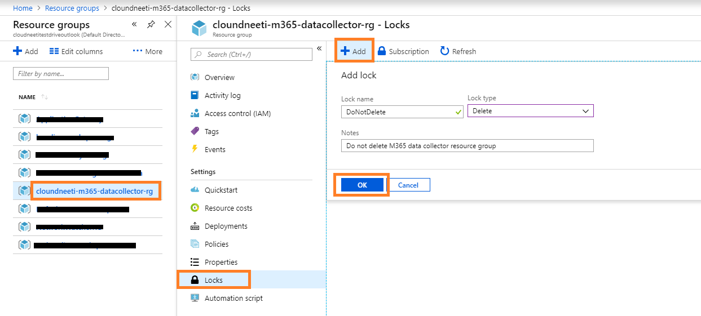
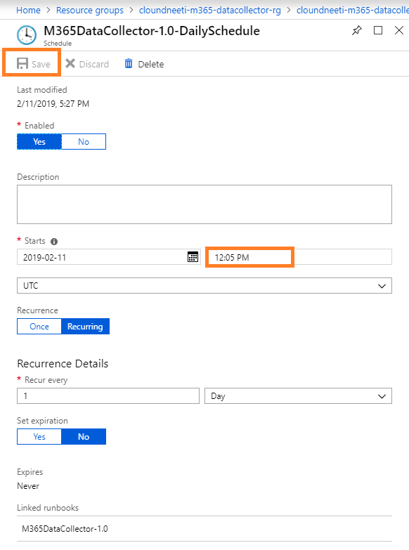

## **Pre-requisite:**

- Must have Office 365 Account 
- One Azure Subscription
- Office Admin should have Office 365 app password **([Use O365 App Password generation procedure](./create-app-password.html))**
- Office administrator should have "Enterprise E5" office license
- The user running M365 data collector on-boarding script should have a contributor or owner access on a Azure subscription 
- The user should have Cloudneeti API keys **[(Use Cloudneeti API key generation procedure)](./api-key-generation.html)**
- M365 data collector on-boarding script should be executed only on Azure CloudShell.

#### Keep below information handy,
- License Id
- Account Id 
- Cloudneeti API Key
- Cloudneeti Environment (dev/demo/trial/prod)
- Cloudneeti Data Collector service principal Id(created at the time of account onboarding)
- Cloudneeti Data Collector service principal Secret (created at the time of account onboarding)
- Office Domain Name
- Office Tenant Id
- Office Administrator Id
- Office Office 365 App Password
- Azure Subscription Id (where data collector resources to be created)
- Data Collector Name 

#### **Note:** Follow below steps to get Cloudneeti Account Id and License Id:
1. To Get **Cloudneeti Account Id:** 
    - Login to Cloudneeti dashboard (For example: <"Cloudneeti Environment">.cloudneeti.com)
    - Click on **Settings** option from left side pane and go to **Manage Accounts**
    - And copy Account Id


1. To Get **Cloudneeti License Id:** 
    - Login to Cloudneeti dashboard (For example: <"Cloudneeti Environment">.cloudneeti.com)
    - Click on **Settings** option from left side pane and go to **Manage Licenses**
    - And copy License Id with respect to account Id

#### Get Below information from Cloudneeti Team,
- M365 data collector provisioning script
- M365 data collector artifacts storage name
- M365 data collector artifacts storage access key


## **M365 data collector provisioning**

1. Login to Azure portal: https://portal.azure.com
2. Switch to Azure active directory where you have a subscription with pre-requisite access.
3. Open CloudShell
Click on Cloudshell icon on the navigation bar to open Cloudshell and Choose PowerShell from shell drop down


4. Run below commands on CloudShell: 
```
# Download Provisioning script
wget https://raw.githubusercontent.com/AvyanConsultingCorp/docs_cloudneeti/master/scripts/Provision-M365DataCollector.ps1 -O Provision-M365DataCollector.ps1

# Switch to the User directory
cd $User
```

**Run provisioning script**
```
./Provision-M365DataCollector.ps1
```
Enter the requested information and script will provision the M365 data collector resources. (Below image for reference)


### **---OR---**
**Run provisioning script with inline parameters**
```
./Provision-M365DataCollector.ps1 -CloudneetiLicenseId <Cloudneeti License Id> `
                                  -CloudneetiAccountId <Cloudneeti Account Id> `
                                  -CloudneetiEnvironment <Cloudneeti Environment> `
                                  -ServicePrincipalId <Cloudneeti Data Collector Service Principal Id> `
                                  -ArtifactsName <Cloudneeti office 365 Data Collector Artifact Name> `
                                  -DataCollectorVersion <Cloudneeti Office 365 Data Collector Version> `
                                  -OfficeDomain <Office 365 Domain Name> `
                                  -OfficeTenantId <Office 365 Tenant Id> `
                                  -OfficeAdminId <Office 365 Administator Id> `
                                  -AzureSubscriptionId <Azure Subscription Id where office 365 data collector resouces will be created> `
                                  -DataCollectorName <Office 365 Data Collector Name> `
                                  -Location <Default EastUs2> <Region> 
```
**Then script execution will prompt you for below details:** (Enter requested information)
- Enter Cloudneeti API Key:
- Enter Cloudneeti Data Collector Service Principal Secret:
- Enter Cloudneeti office 365 Data Collector Artifacts Storage Access Key:
- Enter Office 365 App Password:

## **Post On-boarding Steps:**

#### Apply lock to prevent accidental deletion on Onboarding Resource Group
1. Go to m365 data collector resource group
2. Click on **Locks** under settings
3. Press **Add** button to create resource lock
4. Enter **Lock Name** and select **Lock Type** as Delete
5. Press **OK** to save the lock

   

#### Modify the automation account schedule 

Set the automation account schedule before the Cloudneeti data collection schedule using the below steps,
1. Go to M365 data collector resource group
2. Select Automation account 
3. Click on **Schedules** under **Shared Resources**
4. Select Schedule
   

5. Modify the schedule timings and press **Save** button
   